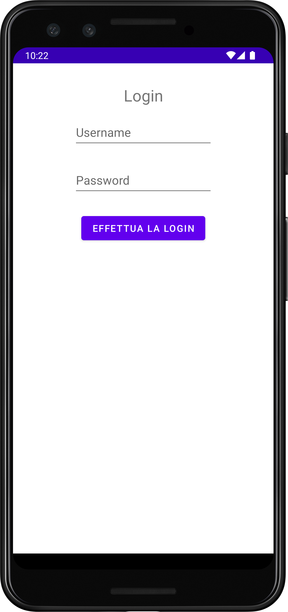

# WHERE 2 EAT

## Un'applicazione Android Nativo per prenotare un ristorante

Questa è un'applicazione che consente a un ipotetico cliente di scegliere da una lista 
o dalla mappa un ristorante e di effettuare una prenotazione scegliendo la data, l'ora e il numero 
di posti.

La lista dei ristoranti popola la schermata home, nella quale l'utente puó visionare l'immagine e le 
informazioni principali dei ristoranti. Cliccando sulle card dei locali si ha accesso alla pagina 
che presenta le informazioni dettagliate del ristorante, dalla quale é possibile eseguire una 
prenotazione.

Dalla barra in alto l'utente puó accedere alla mappa nella quale vengono mostrati i ristoranti 
partendo da quelli vicino alla sua posizione.

Dal menú in alto a destra si puó accedere alla lista delle prenotazioni effettuate per visualizzare 
lo storico oppure effettuare nuove prenotazioni partendo da un ristorante giá visitato.

---

### LOGIN

